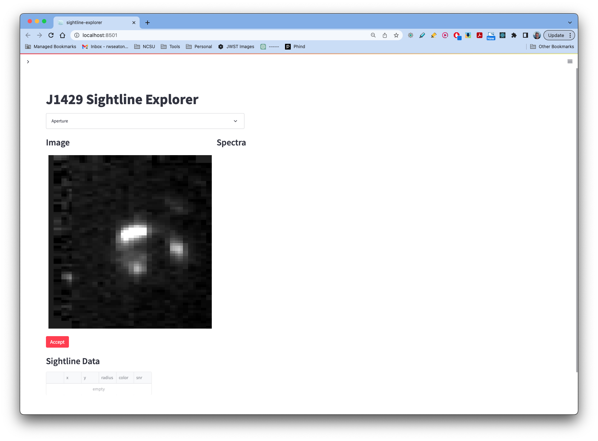
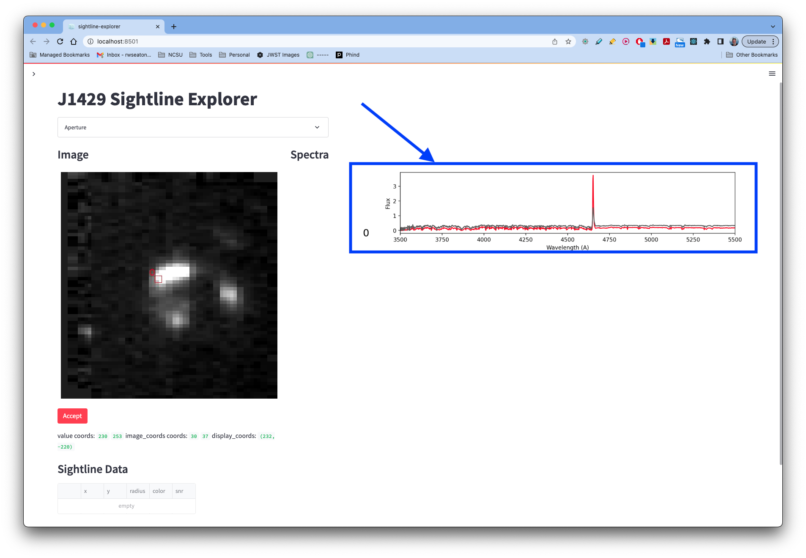
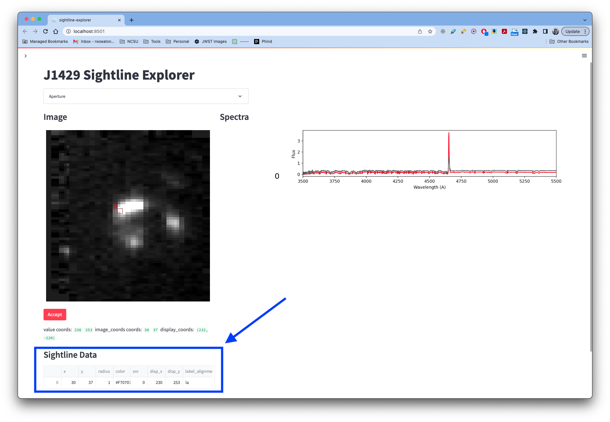
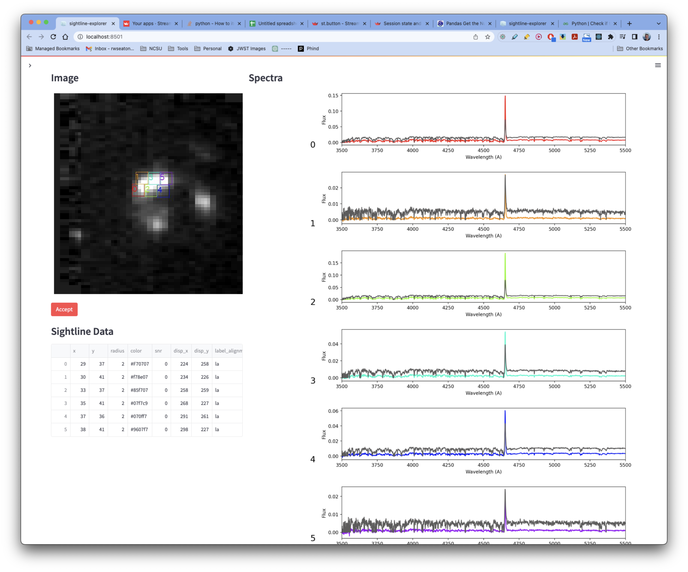

# sightline-explorer

A streamlit app to aid in the exploration and understanding of DLAs using the gravitationally lensed images of background quasars such as J1429. Though this we study the small scale effects of DLAs, and specifically the faint emission lines within the DLAs to better understand the host galaxies. The more lines of sight we have, the better *triangulation* we will have to determine the location of the host galaxies - ray-tracing back to the host galaxies (assuming a correct lensing model for the lensing galaxy).

**sightline-explorer** reads in a FITS flux data cube and an associated variance data cube and displays a whitelight (or suitable variant) of the flux cube to the user. This is the first thing you should see:

Kinda homely right now, I know. But it will get better. When you click on the flux image, the following will happen:

1) A bounding numbered box will be drawn on the flux image representing the area being captured.
2) A 1D spectral extraction of the flux and variance cube will be performed for the sampled area. This will be plotted on the right side of the app. The numbered label assocated with the sample area on the image will correspond to the number label next to the extracted spectra.
   
3) TBD - The Signal-to-Noise ratio will be calculated and displayed next to the spectra.
4) The user can use the live SNR data to determine if the size and placement of the sampled area is appropriate. If not, the user can click on a different location of the image and repeat the above steps.
5) Once happy with the spectra and SNR for this location, click the "Accept" button which will lock in the selection and save the relevant parameters (ie x,y location, bounding box size, color, SNR, etc). 
   
6) Clicking on the image again starts the whole process over again, this time with selection 1 and spectra 1. Do this several times and the UI starts to look less homely...
   

## Environment Setup

I created a new environment for streamlit apps like this

> conda create --name streamlit --file requirements.txt
> conda activate streamlit
> streamlit run src/main.py
